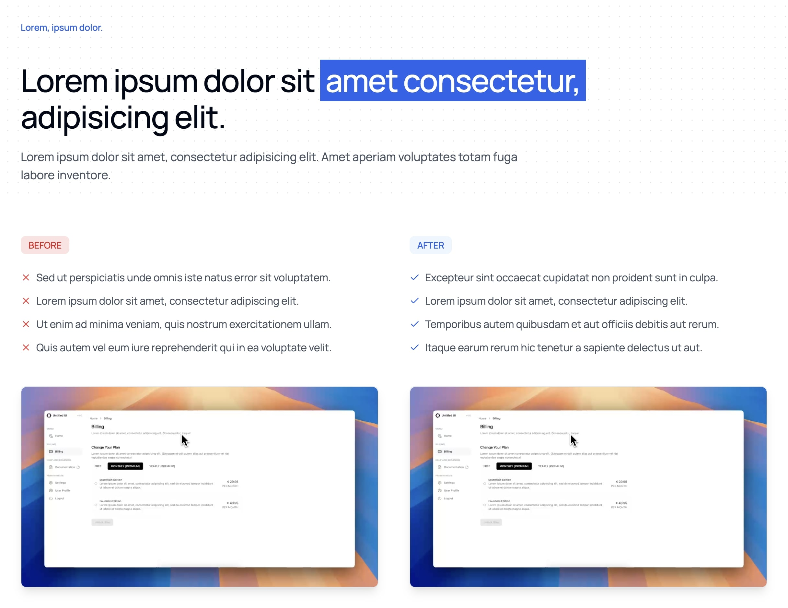

```typescript
import BeforeAfterComparison from "@/components/marketing/BeforeAfterComparison";

<BeforeAfterComparison
    heading={{
        eyebrow: "Lorem, ipsum dolor.",
        title: (
            <>
                Lorem ipsum dolor sit{" "}
                <span className="relative mt-4 inline-block whitespace-nowrap bg-blue-600 p-2 text-white">
                    amet consectetur,
                </span>
                adipisicing elit.
            </>
        ),
        description:
            "Lorem ipsum dolor sit amet, consectetur adipisicing elit. Amet aperiam voluptates totam fuga labore inventore.",
    }}
    before={{
        bulletPoints: [
            {
                text: "Sed ut perspiciatis unde omnis iste natus error sit voluptatem.",
            },
            {
                text: "Lorem ipsum dolor sit amet, consectetur adipiscing elit.",
            },
            {
                text: "Ut enim ad minima veniam, quis nostrum exercitationem ullam.",
            },
            {
                text: "Quis autem vel eum iure reprehenderit qui in ea voluptate velit.",
            },
        ],
        imagePath: "https://framerusercontent.com/assets/hABzjRMXjNw1XA1si9W04jXifs.mp4",
    }}
    after={{
        bulletPoints: [
            {
                text: "Excepteur sint occaecat cupidatat non proident sunt in culpa.",
            },
            {
                text: "Lorem ipsum dolor sit amet, consectetur adipiscing elit.",
            },
            {
                text: "Temporibus autem quibusdam et aut officiis debitis aut rerum.",
            },
            {
                text: "Itaque earum rerum hic tenetur a sapiente delectus ut aut.",
            },
        ],
        imagePath: "https://framerusercontent.com/assets/hABzjRMXjNw1XA1si9W04jXifs.mp4",
    }}
/>;
```

**Contrast Points**: Highlight clear differences between before and after states

```typescript
// ❌ Bad Example - Vague differences
before: {
    bulletPoints: [
        { text: "Manual process" },
        { text: "Takes time" },
    ]
},
after: {
    bulletPoints: [
        { text: "Automated process" },
        { text: "Faster" },
    ]
}

// ✅ Good Example - Specific contrasts
before: {
    bulletPoints: [
        { text: "4+ hours manual data entry per week" },
        { text: "15% error rate in reporting" },
    ]
},
after: {
    bulletPoints: [
        { text: "Automated data entry saves 4 hours/week" },
        { text: "99.9% accuracy in reporting" },
    ]
}
```

**Pain Points**: Focus on real customer challenges

```typescript
// ❌ Bad Example - Generic problems
before: {
    bulletPoints: [{ text: "Old way of doing things" }, { text: "Not very efficient" }];
}

// ✅ Good Example - Specific pain points
before: {
    bulletPoints: [
        { text: "30+ minute setup time for each new project" },
        { text: "$500/month spent on manual processes" },
    ];
}
```

**Visual Evidence**: Use compelling visuals that demonstrate the transformation

```typescript
// ❌ Bad Example - Generic imagery
imagePath: "/generic-screenshot.png";

// ✅ Good Example - Clear comparison
imagePath: "/before-after-workflow-demo.mp4";
```
