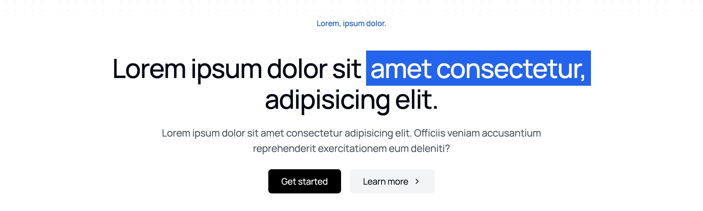

```typescript
import CTA from "@/components/marketing/CTA";

<CTA
    eyebrow="Lorem, ipsum dolor."
    title={
        <>
            Lorem ipsum dolor sit{" "}
            <span className="relative mt-4 inline-block whitespace-nowrap bg-blue-600 p-2 text-white">
                amet consectetur,
            </span>
            adipisicing elit.
        </>
    }
    description="Lorem ipsum dolor sit amet consectetur adipisicing elit. Officiis veniam accusantium reprehenderit exercitationem eum deleniti?"
    primaryButton={{
        text: "Get started",
        onClick: (e) => handleSmoothScroll(e, "#pricing"),
    }}
    secondaryButton={{
        text: "Learn more",
        onClick: (e) => handleSmoothScroll(e, "#features"),
    }}
/>;
```

**Button Hierarchy**: Clear primary and secondary actions

```typescript
// ❌ Bad Example - Unclear hierarchy
primaryButton: { text: "Learn More" },
secondaryButton: { text: "Get Started" }

// ✅ Good Example - Clear hierarchy
primaryButton: { text: "Start Free Trial" },
secondaryButton: { text: "Watch Demo" }
```

**Message Urgency**: Create compelling reasons to act

```typescript
// ❌ Bad Example - Weak call to action
title: "Sign up for our service";
description: "We offer many features";

// ✅ Good Example - Strong value proposition
title: "Launch Your MVP This Weekend";
description: "Join 10,000+ founders who shipped faster with our starter kit";
```
