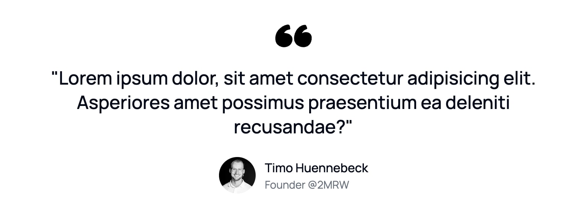

```typescript
import FeaturedTestimonial from "@/components/marketing/FeaturedTestimonial";

<FeaturedTestimonial
    quote="Lorem ipsum dolor, sit amet consectetur adipisicing elit. Asperiores amet possimus praesentium ea deleniti recusandae?"
    author={{
        name: "Timo Huennebeck",
        role: "Founder @2MRW",
        imageUrl: "https://i.imgur.com/E6nCVLy.jpeg",
    }}
/>;
```

### Tips

-   **Testimonial Selection**: Choose testimonials that address common objections

```
// ❌ Bad Example - Generic praise
quote="Great product, really enjoying it!"
// ✅ Good Example - Addresses common concern
quote="I was worried about the learning curve, but we had our entire team up and running in less than a day."
```

-   **Author Credentials**: Include relevant role and company information

```typescript
// ❌ Bad Example - Missing context
author={{
    name: "John Smith",
    role: "User",
    imageUrl: "/john.jpg",
}}
// ✅ Good Example - Complete context
author={{
    name: "John Smith",
    role: "Lead Developer @Fortune500",
    imageUrl: "/john.jpg",
}}
```

-   **Social Proof**: Include recognizable companies or achievements when possible

```typescript
// ❌ Bad Example - Missing social proof
author={{
    name: "Jane Doe",
    role: "Developer",
}}
// ✅ Good Example - Includes social proof
author={{
    name: "Jane Doe",
    role: "Senior Developer @Google, Ex-Microsoft",
}}
```
