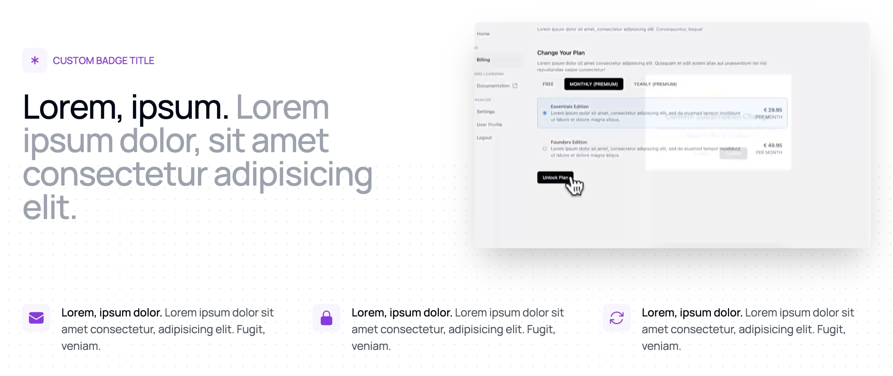

```typescript
import { Features } from "@/components/marketing/Features";

<Features
    features={authFeatures}
    title="Lorem, ipsum."
    subtitle="Lorem ipsum dolor, sit amet consectetur adipisicing elit."
    badge={{
        text: "CUSTOM BADGE TITLE",
        bgColor: "bg-purple-50",
        textColor: "text-purple-600",
    }}
    videoUrl="https://framerusercontent.com/assets/hABzjRMXjNw1XA1si9W04jXifs.mp4"
/>;
```

**Benefit-First Naming**: Lead with outcomes, not technical terms

```typescript
// ❌ Bad Example - Technical name
{
    name: "PostgreSQL Database",
    description: "Scalable database solution"
}

// ✅ Good Example - Outcome name
{
    name: "Enterprise Storage",
    description: "Scale to millions of records without performance issues"
}
```

**Value Proposition**: Always connect features to business outcomes

```typescript
// ❌ Bad Example - Feature description
{
    name: "Authentication System",
    description: "Includes social login options"
}

// ✅ Good Example - Value description
{
    name: "One-Click Auth",
    description: "Boost signup rates by 47% with frictionless social login"
}
```

**Technical Translation**: Make complex features accessible

```typescript
// ❌ Bad Example - Technical jargon
{
    name: "WebSocket Integration",
    description: "Bidirectional real-time communication protocol"
}

// ✅ Good Example - Plain language
{
    name: "Real-Time Updates",
    description: "Keep all users in sync with instant data updates"
}
```

**Quantifiable Results**: Include specific metrics when possible

```typescript
// ❌ Bad Example - Vague benefits
{
    name: "Performance Optimization",
    description: "Makes your app faster"
}

// ✅ Good Example - Specific metrics
{
    name: "Speed Boost",
    description: "Load pages 75% faster with our optimized edge network"
}
```

**Pain Point Focus**: Address specific customer challenges

```typescript
// ❌ Bad Example - Feature listing
{
    name: "Email Templates",
    description: "Collection of email layouts"
}

// ✅ Good Example - Problem solving
{
    name: "Ready-to-Send Emails",
    description: "Skip weeks of email design with 20+ pre-built templates"
}
```

**Implementation Ease**: Emphasize quick time-to-value

```typescript
// ❌ Bad Example - Complex implementation
{
    name: "API Integration",
    description: "RESTful API with documentation"
}

// ✅ Good Example - Easy setup
{
    name: "Quick Connect",
    description: "Integrate with your stack in 15 minutes or less"
}
```
