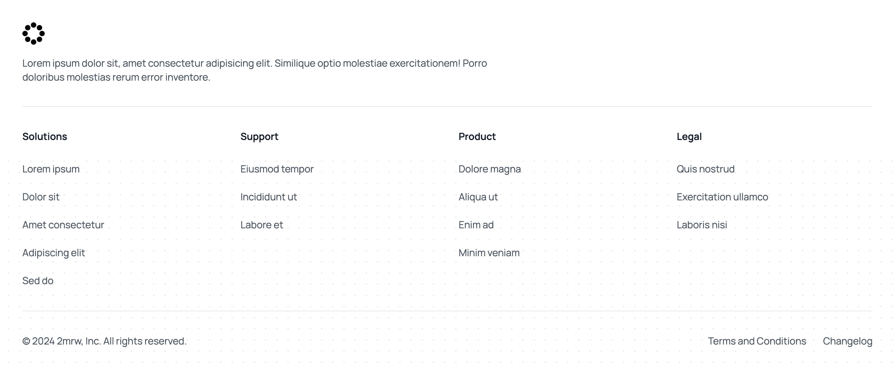

```typescript
import Footer from "@/components/marketing/Footer";

<Footer
    links={footerLinks}
    logo={{
        src: "https://framerusercontent.com/images/XmxX3Fws7IH91jzhxBjAhC9CrPM.svg",
        alt: "Logo",
    }}
    description="Lorem ipsum dolor sit, amet consectetur adipisicing elit. Similique optio molestiae exercitationem! Porro doloribus molestias rerum error inventore."
    companyName="2mrw"
    bottomLinks={[
        { name: "Terms and Conditions", href: "/privacy" },
        { name: "Changelog", href: "/changelog" },
    ]}
/>;
```

**Link Organization**: Group related links logically

```typescript
// ❌ Bad Example - Random grouping
links: {
    group1: [...],
    group2: [...],
}

// ✅ Good Example - Logical sections
links: {
    product: ["Features", "Pricing", "Roadmap"],
    company: ["About", "Blog", "Careers"],
    legal: ["Privacy", "Terms", "Security"],
}
```

**Company Description**: Focus on value proposition

```typescript
// ❌ Bad Example - Generic description
description: "A software company";

// ✅ Good Example - Value-focused description
description: "Helping developers ship production-ready apps in days, not months";
```
