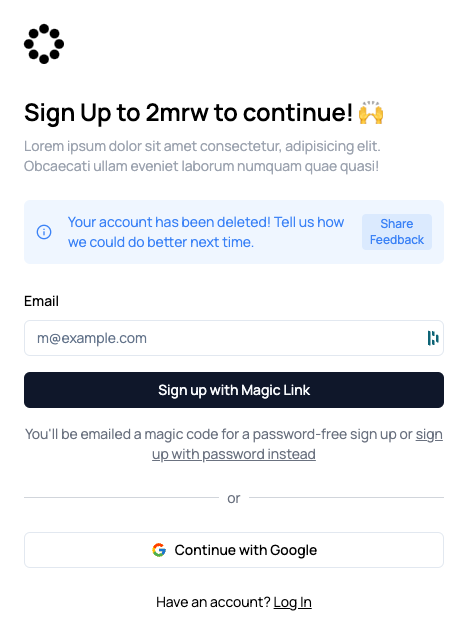

The `FormStatusMessage` component is used to show a message to the user after performing a specific action such as signing up, deleting their account, etc.

It's triggered through the `useParamFeedback.ts` hook which is used to check if the URL contains a specific param.

For instance, for triggering the account deletion message, the URL should contain `?method=account-deleted` when navigating the user to the sign-up page.

```typescript
import FormStatusMessage from "@/components/marketing/FormStatusMessage";

useParamFeedback(setStatusMessage, {
    param: "account-deleted",
    type: "info",
    message: "Your account has been deleted! Tell us how we could do better next time.",
    duration: 0, // won't auto-clear
    action: {
        label: "Share Feedback",
        onClick: () => window.open(appConfig.feedback.forms.accountDeletion.formUrl, "_blank"),
    },
    configKey: "accountDeletion",
});
```
