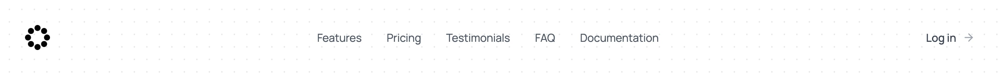

```typescript
import Header from "@/components/marketing/Header";

<Header
    navItems={[
        { href: "#features", label: "Features" },
        { href: "#pricing", label: "Pricing" },
        { href: "#testimonials", label: "Testimonials" },
        { href: "#faq", label: "FAQ" },
        { href: "https://docs.2mrw.dev", label: "Documentation", isExternal: true },
    ]}
    logoSrc="https://framerusercontent.com/images/XmxX3Fws7IH91jzhxBjAhC9CrPM.svg"
    loginOnClick={() => router.push("/auth/sign-in")}
/>;
```

### Tips

It's better to keep the main navigation focused and minimal.

```typescript
// ❌ Bad Example - Too many options
navItems={[
    { href: "#features", label: "Features" },
    { href: "#benefits", label: "Benefits" },
    { href: "#pricing", label: "Pricing" },
    { href: "#testimonials", label: "Testimonials" },
    { href: "#case-studies", label: "Case Studies" },
    { href: "#about", label: "About" },
    { href: "#contact", label: "Contact" },
    { href: "#blog", label: "Blog" },
]}

// ✅ Good Example - Clear hierarchy
navItems={[
    { href: "#features", label: "Features" },
    { href: "#pricing", label: "Pricing" },
    { href: "#testimonials", label: "Testimonials" },
    { href: "https://docs.example.com", label: "Docs", isExternal: true },
]}
```
