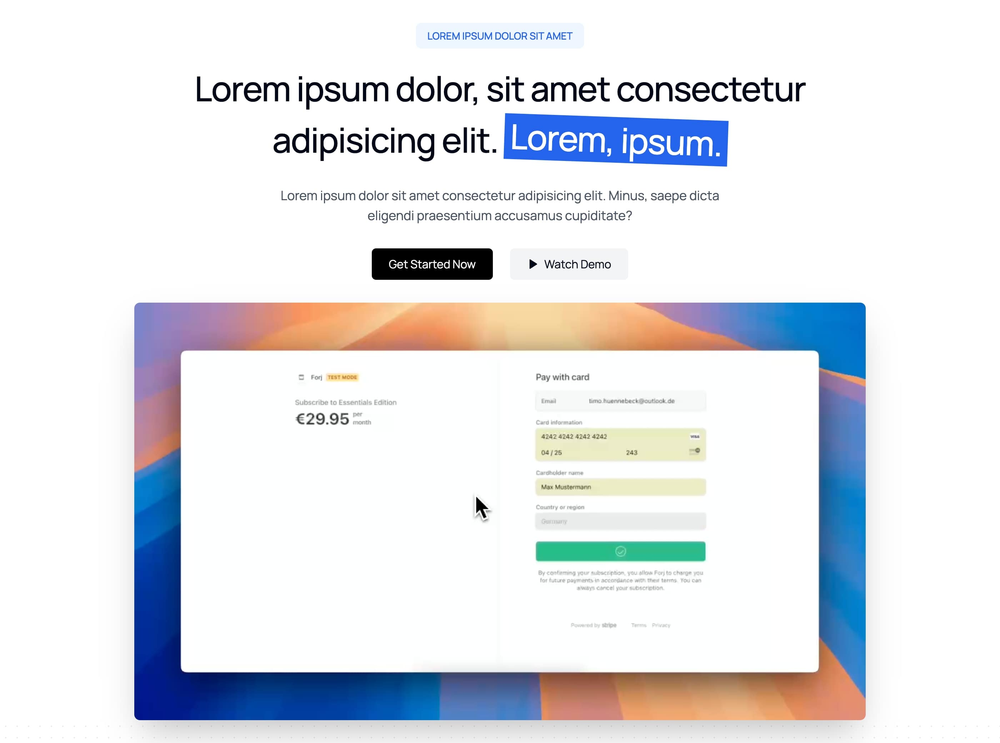

```typescript
import Hero from "@/components/marketing/Hero";

<Hero
    promoText="LOREM IPSUM DOLOR SIT AMET"
    title={
        <>
            Lorem ipsum dolor, sit amet consectetur adipisicing elit.{" "}
            <span className="relative mt-4 inline-block rotate-2 whitespace-nowrap bg-blue-600 p-2 text-white">
                Lorem, ipsum.
            </span>
        </>
    }
    subtitle="Lorem ipsum dolor sit amet consectetur adipisicing elit. Minus, saepe dicta eligendi praesentium accusamus cupiditate?"
    primaryCTA={{
        text: "Get Started Now",
        onClick: (e) => handleSmoothScroll(e, "#pricing"),
    }}
    secondaryCTA={{
        text: "Watch Demo",
        onClick: (e) => handleSmoothScroll(e, "#product-demo"),
    }}
    demoVideoUrl="https://framerusercontent.com/assets/hABzjRMXjNw1XA1si9W04jXifs.mp4"
/>;
```

### Tips

Here are some best practices for using the Hero component:

-   **Headline**: Keep your title under 10 words and focus on the core value proposition

```typescript
// ❌ Bad Example
title =
    "This comprehensive, enterprise-grade solution helps development teams streamline their workflow processes and improve through advanced automation";
// ✅ Good Example
title = "Build Your MVP in a WEEKEND, not Months, with Next.js and Supabase";
```

-   **Supporting Text**: Explain how you deliver on your headline's promise

```typescript
// ❌ Bad Example
description = "Our solution is the best in class";
// ✅ Good Example
description =
    "20+ pre-built React components, authentication, and email templates - everything you need to launch faster";
```

-   **CTAs**: Use action verbs (Get, Start, Learn, etc.) and create a clear hierarchy

```typescript
// ❌ Bad Example
primaryCTA = { text: "Click here", onClick: () => {} };
secondaryCTA = { text: "More info", onClick: () => {} };

// ✅ Good Example
primaryCTA = { text: "Start Building", onClick: () => {} };
secondaryCTA = { text: "Watch Demo", onClick: () => {} };
```

-   **Demo Video**: Show your product in action - make it immediately clear what you do

```
// ❌ Bad Example
"generic-company-intro.mp4"
// ✅ Good Example
"product-walkthrough.mp4"
```

-   **Social Proof**: Consider adding testimonials or trust indicators near the hero

```typescript
// ❌ Bad Example
"Trusted by developers";
// ✅ Good Example
"Trusted by 10,000+ developers from Google, Meta, and Amazon";
```
