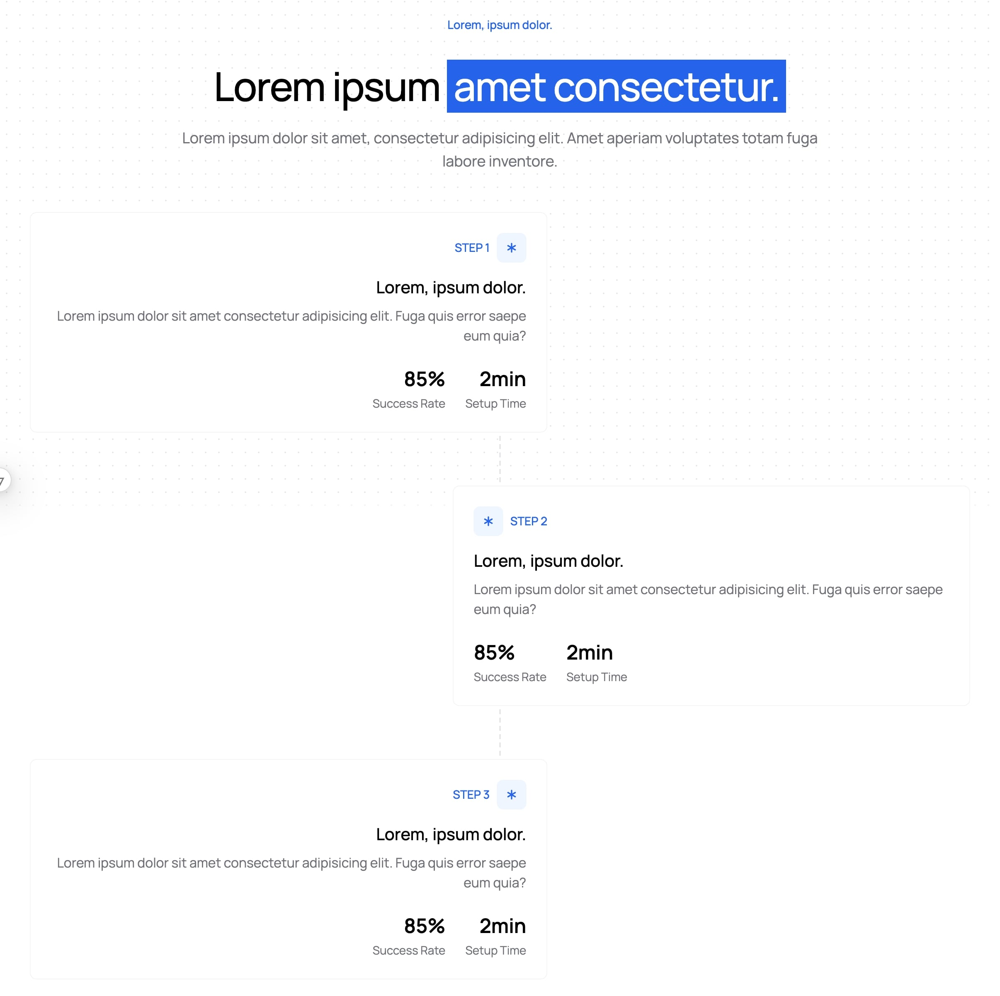

import { Callout, Cards, Card, Tab, Tabs } from "nextra/components";

# How It Works Component



```typescript
import HowItWorks from "@/components/marketing/HowItWorks";

<HowItWorks
    eyebrow="Lorem, ipsum dolor."
    title={
        <>
            Lorem ipsum dolor sit{" "}
            <span className="relative mt-4 inline-block whitespace-nowrap bg-blue-600 p-2 text-white">
                amet consectetur,
            </span>
            adipisicing elit.
        </>
    }
    description="Lorem ipsum dolor sit amet, consectetur adipisicing elit. Amet aperiam voluptates totam fuga labore inventore."
    steps={[
        {
            number: 1,
            title: "Lorem ipsum dolor sit amet.",
            description:
                "Lorem ipsum dolor sit amet, consectetur adipisicing elit. Amet aperiam voluptates totam fuga labore inventore.",
            icon: Settings,
        },
        {
            number: 2,
            title: "Lorem ipsum dolor sit amet.",
            description:
                "Lorem ipsum dolor sit amet, consectetur adipisicing elit. Amet aperiam voluptates totam fuga labore inventore.",
            icon: Settings,
        },
        {
            number: 3,
            title: "Lorem ipsum dolor sit amet.",
            description:
                "Lorem ipsum dolor sit amet, consectetur adipisicing elit. Amet aperiam voluptates totam fuga labore inventore.",
            icon: Settings,
        },
    ]}
    videoPaths={[
        "https://framerusercontent.com/assets/NmYVFvasmFfIhZND3qZbQkMNE.mp4",
        "https://framerusercontent.com/assets/impzjczRdzEPQh2ezMYGWzGe3Y.mp4",
        "https://framerusercontent.com/assets/hABzjRMXjNw1XA1si9W04jXifs.mp4",
    ]}
/>;
```

### Tips

-   **Step Sequence**: Keep steps logical and progressive

```
// ❌ Bad Example - Unclear progression
steps={[
    { title: "Advanced Features", description: "..." },
    { title: "Getting Started", description: "..." },
    { title: "Configuration", description: "..." },
]}
// ✅ Good Example - Clear progression
steps={[
    { title: "Create Account", description: "..." },
    { title: "Configure Settings", description: "..." },
    { title: "Launch Project", description: "..." },
]}
```

-   **Step Descriptions**: Be specific and action-oriented

```
// ❌ Bad Example - Vague descriptions
{
    title: "Setup",
    description: "Do the initial setup of the system.",
}
// ✅ Good Example - Clear instructions
{
    title: "Setup Your Workspace",
    description: "Clone the repository and install dependencies with a single command.",
}
```

-   **Title Structure**: Use clear, benefit-focused headlines

```
// ❌ Bad Example - Generic title
title="How to use our product"
// ✅ Good Example - Benefit-focused title
title={
<>
Three steps to{" "}
<span className="bg-blue-600 text-white">
launch 10x faster
</span>
</>
}
```

-   **Number of Steps**: Keep it between 3-5 steps

```typescript
// ❌ Bad Example - Too many steps
steps={[
    { title: "Step 1", ... },
    { title: "Step 2", ... },
    { title: "Step 3", ... },
    { title: "Step 4", ... },
    { title: "Step 5", ... },
    { title: "Step 6", ... },
    { title: "Step 7", ... },
]}
// ✅ Good Example - Concise steps
steps={[
    { title: "Step 1", ... },
    { title: "Step 2", ... },
    { title: "Step 3", ... },
]}
```
