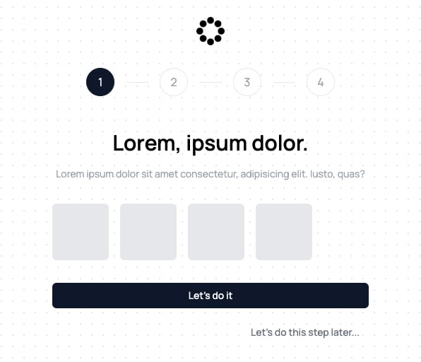

The `OnboardingFlow` component is used to onboard a user to the application. It's a simple component that shows a list of steps that the user needs to complete.

You can customise each step inside the `OnboardingFlow.tsx` file. You can also add / remove steps from the `ONBOARDING_STEPS` arr.

```typescript
import OnboardingFlow from "@/components/marketing/OnboardingFlow";

const ONBOARDING_STEPS: OnboardingStep[] = [
    {
        title: "Lorem, ipsum dolor.",
        description: "Lorem ipsum dolor sit amet consectetur, adipisicing elit. Iusto, quas?",
        buttonText: "Let's do it",
        content: () => (
            <div className="flex flex-col gap-6">
                <div className="flex gap-4">
                    <div className="h-20 w-20 rounded-md bg-gray-200" />
                    <div className="h-20 w-20 rounded-md bg-gray-200" />
                    <div className="h-20 w-20 rounded-md bg-gray-200" />
                    <div className="h-20 w-20 rounded-md bg-gray-200" />
                </div>
            </div>
        ),
    },
    {
        title: "Lorem, ipsum dolor.",
        description: "Lorem ipsum dolor sit amet consectetur, adipisicing elit. Iusto, quas?",
        buttonText: "Let's do it",
        content: () => (
            <div className="flex flex-col gap-6">
                <div className="flex gap-4">
                    <div className="h-20 w-20 rounded-md bg-gray-200" />
                    <div className="h-20 w-20 rounded-md bg-gray-200" />
                </div>
            </div>
        ),
    },
    ...
];
```
