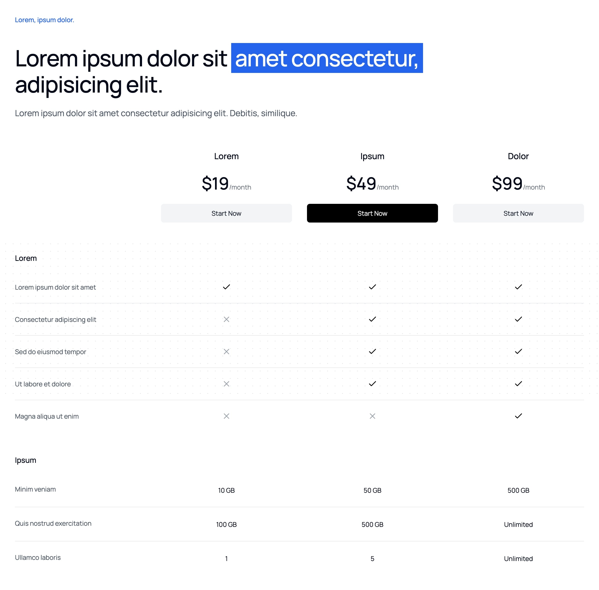

```typescript
import PricingComparison from "@/components/marketing/PricingComparison";

<PricingComparison
    title={
        <>
            Lorem ipsum dolor sit{" "}
            <span className="relative mt-4 inline-block whitespace-nowrap bg-blue-600 p-2 text-white">
                amet consectetur,
            </span>
            adipisicing elit.
        </>
    }
    subtitle="Lorem, ipsum dolor."
    description="Lorem ipsum dolor sit amet consectetur adipisicing elit. Debitis, similique."
    plans={defaultPricingPlans}
    features={defaultPricingFeatures}
    buttonText="Start Now"
/>;
```

**Plan Naming**: Use clear, benefit-focused names

```typescript
// ❌ Bad Example - Generic names
plans: [
    { name: "Basic", price: "10" },
    { name: "Advanced", price: "20" },
];

// ✅ Good Example - Value-focused names
plans: [
    { name: "Starter", price: "10", subtitle: "For solo founders" },
    { name: "Scale", price: "20", subtitle: "For growing teams" },
];
```

**Feature Comparison**: Highlight key differentiators

```typescript
// ❌ Bad Example - Vague features
features: [
    { name: "Support", basic: true, pro: true },
    { name: "Advanced Features", basic: false, pro: true },
];

// ✅ Good Example - Specific features
features: [
    { name: "Email Support", basic: "24/7", pro: "Priority 24/7" },
    { name: "API Calls", basic: "10K/month", pro: "Unlimited" },
];
```
