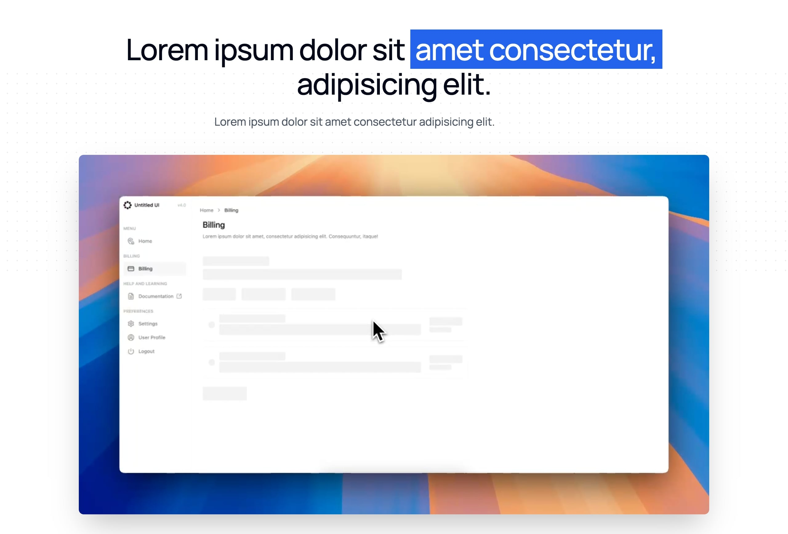

```typescript
import ProductDemo from "@/components/marketing/product-demo";

<ProductDemo
    eyebrow="Lorem, ipsum dolor."
    title={
        <>
            Lorem ipsum dolor sit{" "}
            <span className="relative mt-4 inline-block whitespace-nowrap bg-blue-600 p-2 text-white">
                amet consectetur,
            </span>
            adipisicing elit.
        </>
    }
    subtitle="Lorem ipsum dolor sit amet consectetur adipisicing elit."
    videoUrl="https://youtu.be/iiz-MjH5tNs"
/>;
```

### Tips

**Video Content**: Show real usage scenarios, not marketing fluff

```typescript
// ❌ Bad Example - Generic demo
videoUrl = "/company-overview.mp4";

// ✅ Good Example - Specific use case
videoUrl = "/user-workflow-demo.mp4";
```

**Title Focus**: Emphasize the key benefit or solution

```typescript
// ❌ Bad Example - Feature-focused title
title="Product Demo Video"

// ✅ Good Example - Benefit-focused title
title={
    <>
        See how you can{" "}
        <span className="bg-blue-600 text-white">
            save 10 hours per week
        </span>
    </>
}
```

**Subtitle Context**: Provide clear context for what viewers will see

```typescript
// ❌ Bad Example - Vague subtitle
subtitle = "Watch how our product works";

// ✅ Good Example - Specific context
subtitle =
    "Follow along as we show you how to set up your workspace and deploy your first project in under 5 minutes";
```

**Video Length**: Keep demos concise and focused

```typescript
// ❌ Bad Example - Long, comprehensive demo
// 10-minute video covering every feature

// ✅ Good Example - Focused demo
// 2-3 minute video showing core workflow
```
