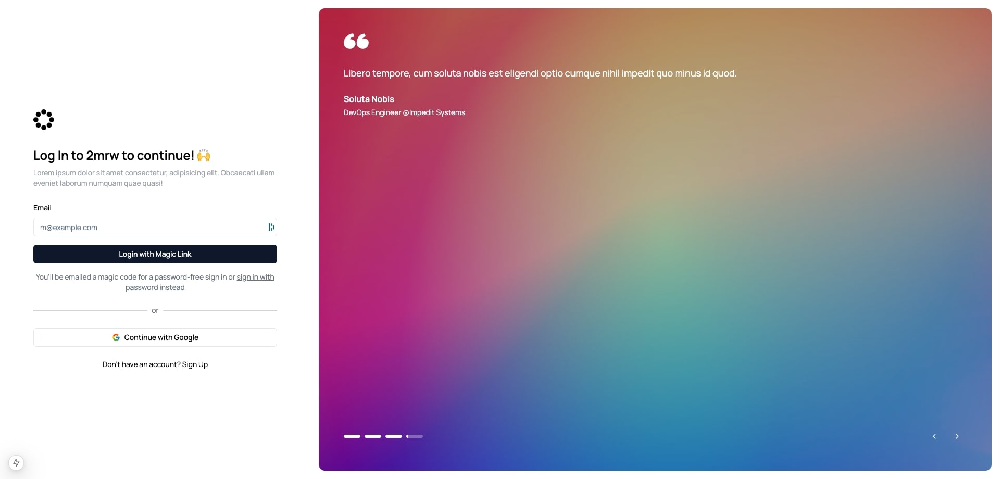

The `TestimonialSidePanel` component will show an image and its testimonial for 5 seconds before continuing. The data used for the testimonial side panel is stored inside the `testimonials-data.ts` file.

You can show / hide specific testimonials through setting the `showInSidePanel` boolean to `true` or `false`.

```typescript
import TestimonialSidePanel from "@/components/marketing/TestimonialSidePanel";

export const testimonials: Testimonial[] = [
    {
        content: {
            text: "Lorem ipsum dolor sit amet, consectetur adipiscing elit. Sed do eiusmod tempor incididunt ut labore et dolore magna aliqua.",
            highlights: ["dolor sit amet"],
        },
        author: {
            name: "Lorem Ipsum",
            role: "CTO",
            company: "Dolor Sit",
            image: "https://i.imgur.com/E6nCVLy.jpeg",
        },
        rating: 5,
        featured: true,
        date: "2024-03-15",
        verified: true,
        showInSidePanel: true,
        backgroundUrl:
            "https://images.unsplash.com/photo-1497366811353-6870744d04b2?q=80&w=2940&auto=format&fit=crop",
    },
    ...
];
```
