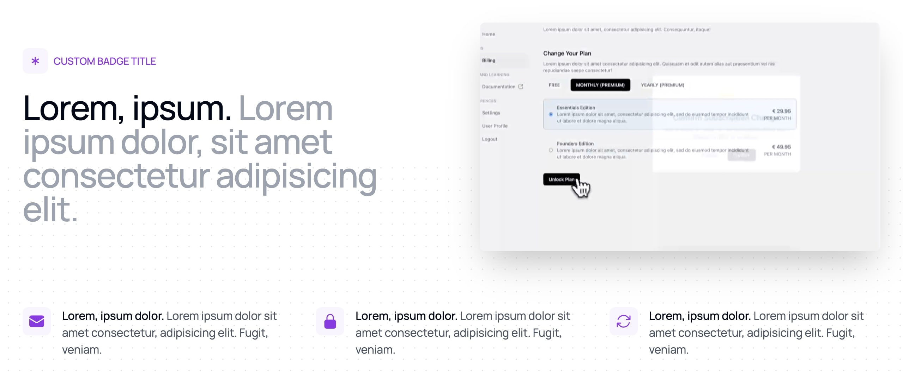
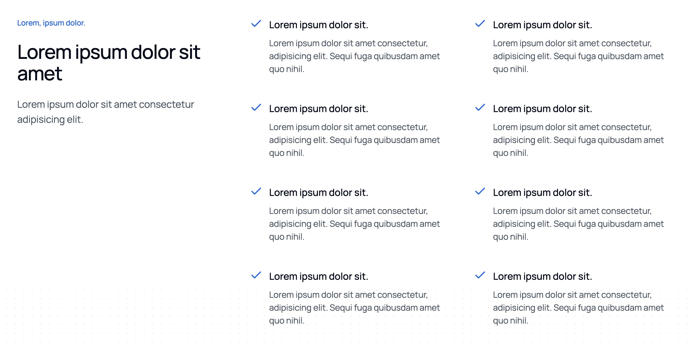
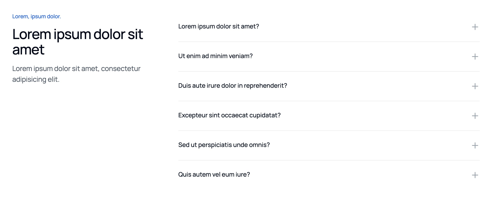
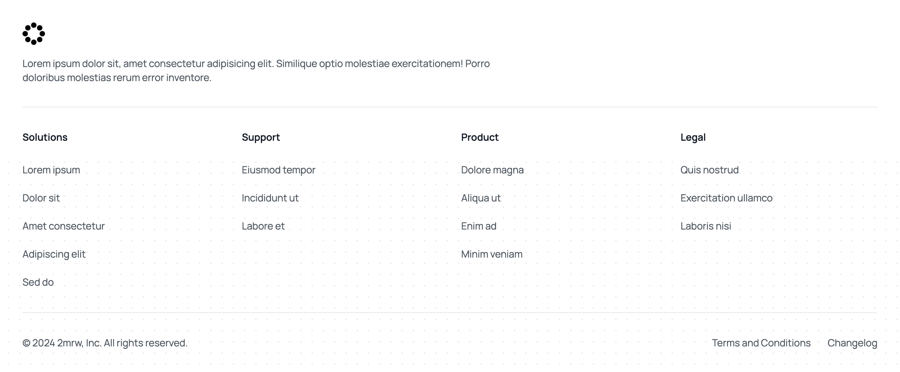

In order to launch the landing page, we'll just have to replace the **Lorem Ipsum** with our actual content. Here's a breakdown of each file and what it's used for:

### features-data.ts

This file contains the data for each of the features in the `features.tsx` component — the three ones shown at the bottom of the page.

### features-list-data.ts

This file contains the data for each of the features in the `features-list.tsx` component.

### stats-data.ts

This file contains the data for the `stats.tsx` component.

### testimonials-data.ts

This file contains the data for the `testimonials-grid.tsx` and `testimonial-side-panel.tsx` components.

### faq-data.ts

This file contains the data for the `faq.tsx` component.

### footer-data.ts

This file contains the data for the `footer.tsx` component — split into `footerLinks` (the main links) and `bottomLinks` (the links at the bottom of the footer).

